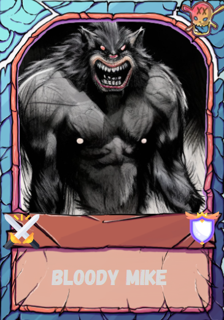
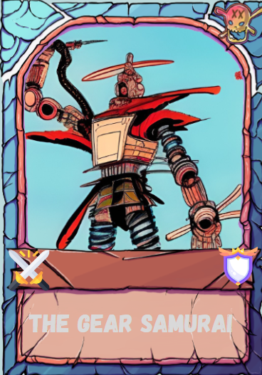
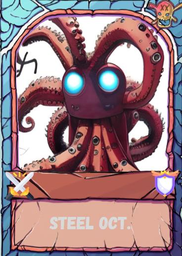
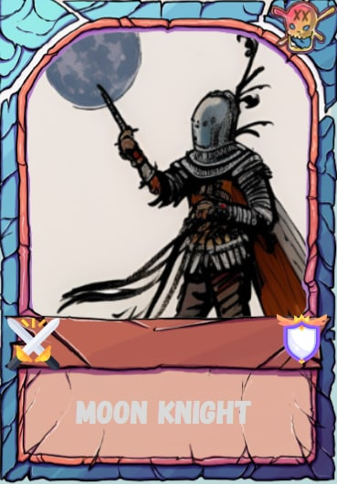

### Multiplayer Web3 NFT Card Game

# Table of contents:
* [General Info](#general-info)
* [Stack of Technologies](#technologies)
* [Instructions for players](#instructions)
* [Changes](#changes)

# General Info
This project was made following a tutorial from JavaScript Mastery. 
This is a card game where each card is a Game Token that has levels of attack and defense.
With their own deck, each person will be able to enter the game and create a battlefield that another player can join. 
During combat, you have two options: defense and attack. 
The fight continues until someone gives up or loses.

# Technologies
Project was created with:
* Solidity 0.8.16
* Hardhat 2.12.2
* React 18.2.0
* Web3Modal 1.9.9
* Ethers 5.7.1
* Node.js 16.17.0
* JavaScript 

# Instructions
* Install the Core Wallet browser extension ([Chrome](https://chrome.google.com/webstore/detail/core/agoakfejjabomempkjlepdflaleeobhb))
* Create your own wallet
* Go to the site where we deployed our [game](https://unrivaled-cucurucho-fcd02a.netlify.app)
* Make sure that your account is on the Fuji network and you have tokens (AVAX). 
  If you don't have tokens you can apply for test tokens on the [website](https://faucet.avax.network/)
* Congratulations🎉! Now you can start. First of all, set your nickname in the game and approve the transaction.
* Next, you can create a new battle or join an existing one. Also approve the transaction.
* Whoo, the fight has begun!⚔️ Attack or defend, don't forget to approve transactions after each action. I wish you victories in your battles👍.

# Changes
| New cards | | 
:--------------------------:|:--------------------------:
  |  
  |  
